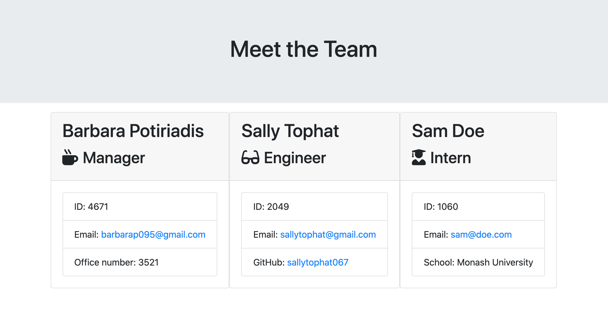
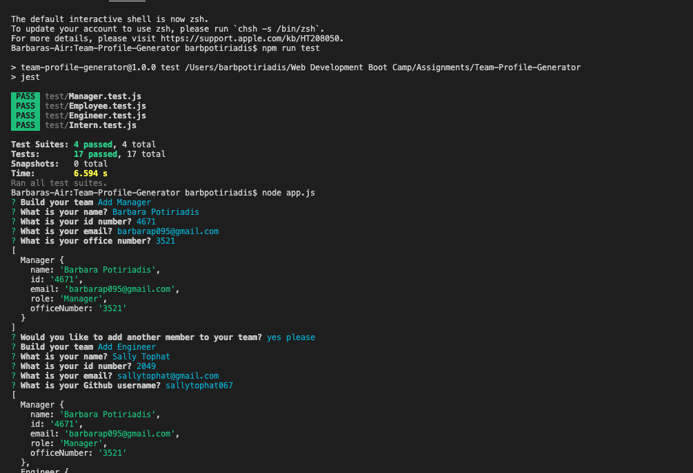

# Team-Profile-Generator
A great application that generates a profile of your team and their contact details.

## Description
This is a Node CLI application that takes in information about employees including their role, name, id and email address, as well as other attributes that are role-specific, such as an office number for managers, github username for engineers and school for interns. 

An HTML page is generated with the rendered profiles and their respective attributes.

There are three roles - Manager, Engineer and Intern, which all inherit the properties of its parent class - 'Employee.' 

All units have passed the test.

## Video of user flow
https://drive.google.com/file/d/1qb3fogZEOd2BaxS129ipGzi1xCDQ10Ro/view?usp=sharing

## Images of application

